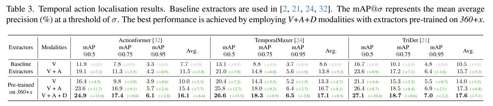

# Install NMS (nms_1d_cpu)
cd ./nms_1d_cpu
python setup.py install --user


# Results

Pre-trained on 360+x,  V+A+D

```
ckpt/360_results/actionformer/360_i3d_10011_new/epoch_200.pth.tar    actionformer_10011.pth.tar
../ckpt/temporalmaxer/360_i3d_10011_new/epoch_200.pth.tar    temporalmaxer_10011.pth.tar
../ckpt/tridet/360_i3d_10011_new/epoch_500.pth.tar   tridet_10011.pth.tar
```

```
Label json_file: "/bask/projects/j/jiaoj-3d-vision/Hao/360x/360x_Video_Experiments/db_utils/temporal_label.json.npy"

```

```
Feat is in:
/bask/projects/j/jiaoj-3d-vision/360XProject/Extractx360dataset
---- Video id
	|----360_trim
		|----360_panoramic_trim  	
			|----cut1, cut2, cut3...
				|----audio_feat.npy
				|----video_feat.npy
		|----front_view_trim
			|----cut1, cut2, cut3...
				|----at.npy
				|----audio_feat.npy
				|----video_feat.npy
	|----stereo_trim
		|----clip, clip2, clip3
			|----binocular_trim
				|----cut1, cut2, cut3...
                      |----audio_feat.npy
                      |----video_feat.npy
			|----monocular_trim
				|----cut1, cut2, cut3...
                      |----audio_feat.npy
                      |----video_feat.npy
Don't upload the frame related 
```



---

TemporalMaxer

|tIoU = 0.50: mAP = 26.78 (%) Recall@1x = 26.84 (%) Recall@5x = 30.12 (%) 
|tIoU = 0.55: mAP = 25.59 (%) Recall@1x = 25.41 (%) Recall@5x = 28.70 (%) 
|tIoU = 0.60: mAP = 22.55 (%) Recall@1x = 23.28 (%) Recall@5x = 25.80 (%) 
|tIoU = 0.65: mAP = 20.91 (%) Recall@1x = 20.92 (%) Recall@5x = 23.14 (%) 
|tIoU = 0.70: mAP = 18.95 (%) Recall@1x = 16.81 (%) Recall@5x = 19.61 (%) 
|tIoU = 0.75: mAP = 16.33 (%) Recall@1x = 15.99 (%) Recall@5x = 17.99 (%) 
|tIoU = 0.80: mAP = 12.75 (%) Recall@1x = 13.91 (%) Recall@5x = 16.52 (%) 
|tIoU = 0.85: mAP = 10.42 (%) Recall@1x = 12.64 (%) Recall@5x = 14.52 (%) 
|tIoU = 0.90: mAP = 9.20 (%) Recall@1x = 10.04 (%) Recall@5x = 10.90 (%) 
|tIoU = 0.95: mAP = 6.39 (%) Recall@1x = 5.46 (%) Recall@5x = 5.46 (%) 

---------------------------

Actionformer (ckpt ready)

|tIoU = 0.50: mAP = 25.98 (%) Recall@1x = 31.68 (%) Recall@5x = 38.07 (%) 
|tIoU = 0.55: mAP = 22.84 (%) Recall@1x = 28.23 (%) Recall@5x = 34.44 (%) 
|tIoU = 0.60: mAP = 19.45 (%) Recall@1x = 27.20 (%) Recall@5x = 33.73 (%) 
|tIoU = 0.65: mAP = 19.20 (%) Recall@1x = 23.04 (%) Recall@5x = 29.10 (%) 
|tIoU = 0.70: mAP = 17.46 (%) Recall@1x = 19.40 (%) Recall@5x = 23.76 (%) 
|tIoU = 0.75: mAP = 15.40 (%) Recall@1x = 16.96 (%) Recall@5x = 21.19 (%) 
|tIoU = 0.80: mAP = 11.52 (%) Recall@1x = 14.01 (%) Recall@5x = 17.62 (%) 
|tIoU = 0.85: mAP = 9.50 (%) Recall@1x = 12.18 (%) Recall@5x = 13.42 (%) 
|tIoU = 0.90: mAP = 8.89 (%) Recall@1x = 9.51 (%) Recall@5x = 10.34 (%) 
|tIoU = 0.95: mAP = 6.20 (%) Recall@1x = 5.19 (%) Recall@5x = 5.31 (%)

-----------

TriDet

|tIoU = 0.50: mAP = 26.98 (%) Recall@1x = 32.32 (%) Recall@5x = 36.42 (%) 
|tIoU = 0.55: mAP = 25.26 (%) Recall@1x = 29.66 (%) Recall@5x = 33.51 (%) 
|tIoU = 0.60: mAP = 23.27 (%) Recall@1x = 28.87 (%) Recall@5x = 32.79 (%) 
|tIoU = 0.65: mAP = 21.91 (%) Recall@1x = 26.77 (%) Recall@5x = 30.54 (%) 
|tIoU = 0.70: mAP = 21.55 (%) Recall@1x = 25.43 (%) Recall@5x = 29.07 (%) 
|tIoU = 0.75: mAP = 19.37 (%) Recall@1x = 22.97 (%) Recall@5x = 25.28 (%) 
|tIoU = 0.80: mAP = 16.77 (%) Recall@1x = 21.58 (%) Recall@5x = 23.18 (%) 
|tIoU = 0.85: mAP = 16.24 (%) Recall@1x = 20.28 (%) Recall@5x = 21.48 (%) 
|tIoU = 0.90: mAP = 12.08 (%) Recall@1x = 16.38 (%) Recall@5x = 18.38 (%) 
|tIoU = 0.95: mAP = 7.21 (%) Recall@1x = 11.66 (%) Recall@5x = 11.72 (%) 


